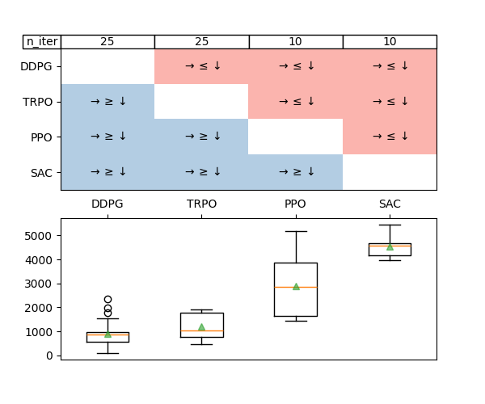

# Tutorial

There are two ways to use AdaStop:

- Command line interface: AdaStop can be used as a command line interface that takes csv files as input. The cli interface can either be called interactively or the process can be automated using bash script.
- Python API: AdaStop is coded in python and can directly be imported as a module to be used in a python script.

In this tutorial we show how to use the CLI as it seem more convenient and more adapted to the majority of users.

## Case study: Comparison of Reinforcement Learning algorithms

The command line interface takes csv files as input. Each csv file must contain a dataframe with $n$ rows and as many columns as there are algorithms. Each of the $n$ rows corresponds to one run of an algorithm.
Please note that if, in the process of the algorithm, all the comparisons for one of the algorithm are decided, then this algorithm does not need to be run anymore and the number of columns in the next csv file would decrease.

Below, we give an example based on files containing the evaluations of PPO,DDPG,SAC,TRPO, four Deep Reinforcement Learning algorithmes, given in the `examples` directory.

The AdaStop algorithm is initialized with the first test done through `adastop compare` and the current state of AdaStop is then saved in a pickle file:

```bash
adastop
```
```console
Usage: adastop [OPTIONS] COMMAND [ARGS]...

  Program to perform adaptive stopping algorithm using csv file intput_file.

  Use adastop sub-command --help to have help for a specific sub-command

Options:
  --help  Show this message and exit.

Commands:
  compare  Perform one step of adaptive stopping algorithm using csv file...
  plot     Plot results of the comparator situated in the folder 'folder'.
  reset    Reset the comparator to zero by removing the save file of the...
  status   Print the status of the comparator located in the folder...
```
```bash
adastop compare --help
```
```console
Usage: adastop compare [OPTIONS] INPUT_FILE

  Perform one step of adaptive stopping algorithm using csv file intput_file.
  The csv file must be of size `size_group`. At first call, the comparator
  will be initialized with the arguments passed and then it will be saved to a
  save file in `.adastop_comparator.pkl`.

Options:
  --n-groups INTEGER        Number of groups.  [default: 5]
  --size-group INTEGER      Number of groups.  [default: 5]
  --n-permutations INTEGER  Number of random permutations.  [default: 10000]
  --alpha FLOAT             Type I error.  [default: 0.05]
  --beta FLOAT              early accept parameter.  [default: 0.0]
  --seed INTEGER            Random seed.
  --compare-to-first        Compare all algorithms to the first algorithm.
  --help                    Show this message and exit.
```
```bash
cat examples/walker1.csv # file contains evaluations on walker environment
```
```console
,PPO,DDPG,SAC,TRPO
0,3683.49072265625,420.27471923828125,4291.02978515625,446.09295654296875
1,1576.483154296875,640.0671997070312,4551.0380859375,1918.919677734375
2,3908.14013671875,2338.0419921875,4669.77490234375,1015.7262573242188
3,1451.9110107421875,879.0955200195312,4697.365234375,757.0098876953125
4,5177.005859375,736.5420532226562,4074.497802734375,1769.3448486328125
```
```bash
adastop reset . # reset the state of the comparator (remove hidden pickle file)
```
```console
Comparator file have been removed.
```
```bash
adastop compare --n-groups 5 --beta 0.01 --seed 42 walker1.csv 
```
```console
Still undecided about DDPG PPO SAC TRPO

Comparator Saved
```
After this first step, it is still undecided what is the ranking of DDPG and TRPO  (e.g. the "continue" decisions). We have to generate new runs for all the algorithms in order to have more information and be able to rank these algorithms. Once these runs are generated, we continue the process.

```console
> adastop compare --n-groups 5 --size-group 5 --beta 0.01 --seed 42 walker2.csv
Still undecided about DDPG TRPO

Comparator Saved

> adastop compare --n-groups 5 --size-group 5 --beta 0.01 --seed 42 walker3.csv
Still undecided about DDPG TRPO

Comparator Saved

> adastop compare --n-groups 5 --size-group 5 --beta 0.01 --seed 42 walker4.csv
Still undecided about DDPG TRPO

Comparator Saved

> adastop compare --n-groups 5 --size-group 5 --beta 0.01 --seed 42 walker5.csv


Test is finished, decisions are
|    | Agent1 vs Agent2   |   mean Agent1 |   mean Agent2 |   mean diff |   std Agent 1 |   std Agent 2 | decisions   |
|---:|:-------------------|--------------:|--------------:|------------:|--------------:|--------------:|:------------|
|  0 | PPO vs DDPG        |      2901.53  |       884.119 |    2017.41  |       1257.93 |       535.74  | larger      |
|  0 | PPO vs SAC         |      2901.53  |      4543.4   |   -1641.87  |       1257.93 |       432.13  | smaller     |
|  0 | PPO vs TRPO        |      2901.53  |      1215.42  |    1686.11  |       1257.93 |       529.672 | larger      |
|  0 | DDPG vs SAC        |       884.119 |      4543.4   |   -3659.28  |        535.74 |       432.13  | smaller     |
|  0 | DDPG vs TRPO       |       884.119 |      1215.42  |    -331.297 |        535.74 |       529.672 | smaller     |
|  0 | SAC vs TRPO        |      4543.4   |      1215.42  |    3327.98  |        432.13 |       529.672 | larger      |

Comparator Saved
```
The process stops and we can plot the resulting decisions.



If one wants to reset AdaStop to redo the process, one can use `adastop reset examples`.
